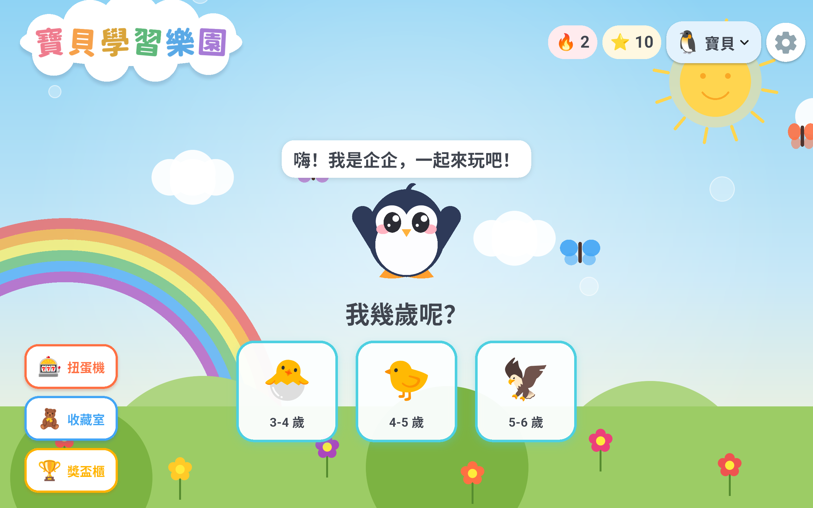
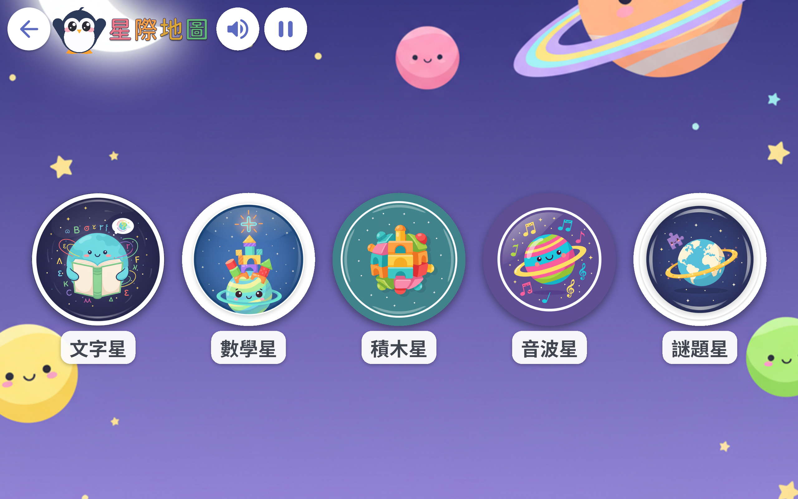
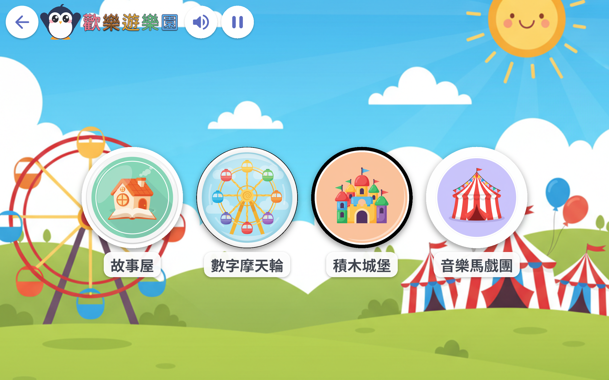
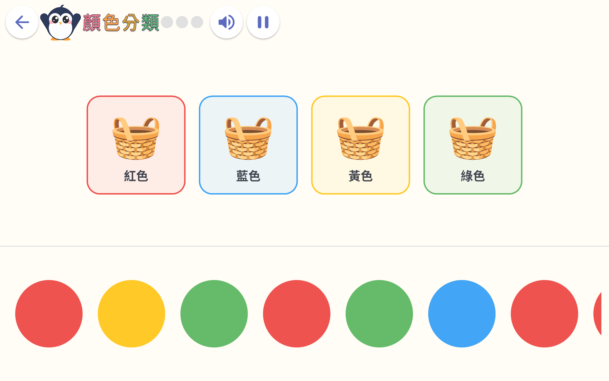
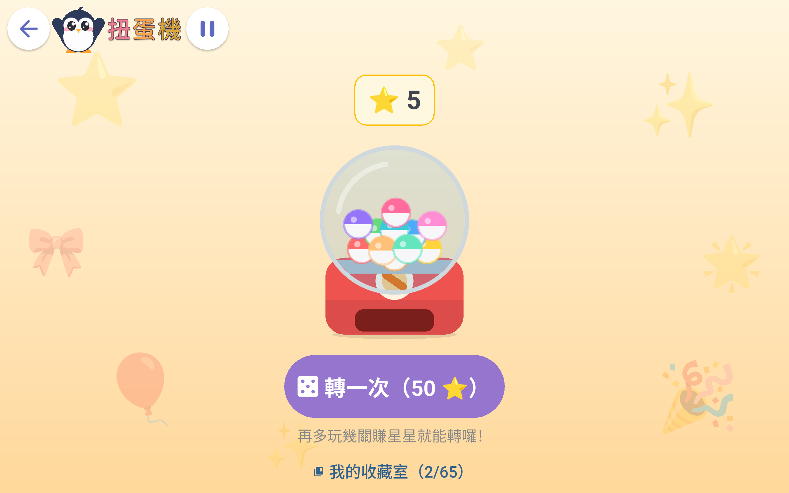
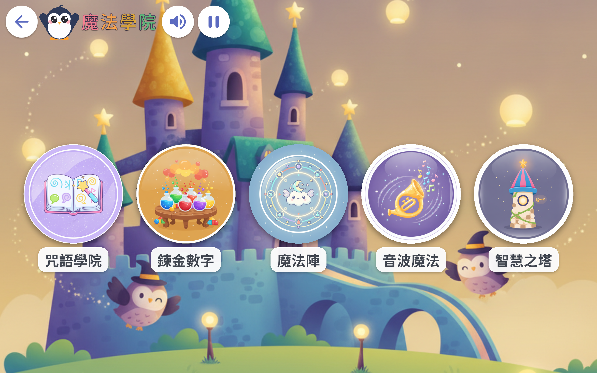

# 寶貝學習樂園 🐧

專為學齡前幼兒（3–6 歲）設計的中文（繁體）平板學習 App。以「多元智能」為骨架，把語文、邏輯數學、空間、音樂、動腦五大領域包裝成可探索的主題世界，全程語音引導、零文字依賴，孩子不用識字也能自己玩。

橫向鎖定、沉浸式全螢幕、家長驗證關卡與螢幕使用時間管理，適合平板親子共學。

## 畫面預覽

| 首頁 | 太空探險（4-5） | 歡樂遊樂園（3-4） |
|---|---|---|
|  |  |  |

| 遊戲中 | 扭蛋獎勵 | 魔法學院（5-6） |
|---|---|---|
|  |  |  |

## ✨ 特色

- **三個年齡段 × 主題世界**：3-4 歡樂遊樂園 🎡、4-5 太空探險 🚀、5-6 魔法學院 🪄。每段都有專屬的童書插畫探索地圖與動畫背景。
- **五大領域**：語文 🗣️、邏輯數學 🔢、空間 🧩、音樂 🎵、動腦 🧠。
- **全語音引導**：所有題目、提示、稱讚都用 zh-TW 神經網路語音預先烤成 mp3，離線即可播放。
- **適性難度**：每個遊戲依孩子表現自動升降難度，永遠不會卡關也不會太簡單。
- **獎勵系統**：答題賺星星 ⭐ → 扭蛋抽玩具 🎁 → 收藏圖鑑、成就獎盃 🏆、每日簽到連續獎勵。
- **家長友善**：螢幕時間管理、家長驗證關卡（算術題擋住設定頁）、橫向 + 沉浸式全螢幕避免幼兒誤觸。
- **RWD**：UI 依裝置比例縮放，不寫死尺寸。

## 🎮 遊戲與領域

依「年齡段 × 領域」自動過濾顯示，全部遊戲集中註冊於 [`lib/content/registry.dart`](lib/content/registry.dart)（新增遊戲只要加一筆 `GameDef`）。涵蓋聽音指圖、顏色／形狀分類、走迷宮、拼圖、加減乘法、比大小、找規律、記憶翻牌、找不同、對稱鏡像、數獨、注音開頭、認國字、量詞、反義詞、樂器辨音、音波記憶，以及一系列聽辨音樂能力的遊戲（高高低低／快快慢慢／大聲小聲／音的長短／音往哪裡走／這首對嗎，依幼兒音樂發展研究排序）等。

> 年齡段 enum 定義於 [`lib/models/age_band.dart`](lib/models/age_band.dart)；領域定義於 [`lib/models/domain.dart`](lib/models/domain.dart)。

## 🧱 技術棧

- **Flutter / Dart**（SDK `^3.12.1`）
- `audioplayers` — 語音 / 音效 / 背景音樂播放
- `flutter_tts` — 後備即時語音
- `sqflite` + `path` — 本地進度資料庫
- `shared_preferences` — 輕量設定
- `crypto` — 台詞雜湊（對應預烤音檔檔名）
- `flutter_launcher_icons` — 產生各平台 App 圖示

## 📁 專案結構

```
lib/
  main.dart            # 進入點：橫向鎖定、沉浸式全螢幕、初始化服務
  app.dart             # App 根 widget（標題「寶貝學習樂園」）
  models/              # AgeBand、Domain、GameDef 等資料模型
  content/             # 各遊戲題庫 / 關卡資料 + registry.dart 註冊表
  games/               # 遊戲 widget（含共用引擎 PickGame / DragMatchGame / ListenChooseGame…）
  screens/             # 首頁、年齡選擇、地圖、收藏、獎盃、設定等 9 個畫面
  core/                # 服務層：audio_service、progress_store、db、
    widgets/           #   螢幕時間、家長關卡、共用 widget 與動畫背景
assets/                # voice / sfx / music / images / fonts / icon
tool/                  # Python 資產生成腳本（語音、插圖、音樂、音效、LOGO、字型）
test/                  # 單元 / widget 測試
android/               # Android 平台專案
promo_shots/           # 商店宣傳截圖
```

## 🚀 開始開發

需求：[Flutter SDK](https://docs.flutter.dev/get-started/install)（含 Dart）。

```bash
# 取得套件
flutter pub get

# 在已連接的裝置 / 模擬器執行（建議平板、橫向）
flutter run

# 靜態分析
flutter analyze

# 跑測試
flutter test
```

## 🎨 資產生成管線

App 用到的語音、插圖、音樂、音效、圖示、字型都由 [`tool/`](tool/) 下的 Python 腳本產生（產物已 commit 在 `assets/`，平時不需重跑；改了對應內容才需要）：

| 腳本 | 產出 | 何時重跑 |
|---|---|---|
| `gen_voice.py` | `assets/voice/*.mp3` + `voice_manifest.dart` | **新增 / 修改任何台詞後必跑**，否則該句靜音 |
| `gen_art.py` | `assets/images/` 探索地圖插圖（需 `GEMINI_API_KEY`） | 改地圖入口圖 / 背景時 |
| `gen_bgm.py` | `assets/music/bgm.mp3` | 改背景音樂時（需 ffmpeg） |
| `gen_sfx.py` | `assets/sfx/success.mp3` | 改答對音效時（需 ffmpeg） |
| `gen_tones.py` | `assets/sfx/tone_*.mp3`、`melody_*.mp3`（音樂聽辨遊戲用） | 改音樂遊戲音效時（需 ffmpeg + numpy）。音色取自真實鋼琴錄音，經 FFT 諧波篩出單音再 pitch-shift；可用 `PIANO_SRC` 環境變數換來源、給命令列參數改輸出資料夾（先試聽）。 |
| `gen_logo.py` | `assets/icon/app_icon*.png` | 改 LOGO 時，之後跑 `dart run flutter_launcher_icons` |
| `subset_title_font.py` | `assets/fonts/title-*.otf` | **新增任何用 TitleFont 顯示的文字後必跑**，否則顯示成豆腐框 □ |

> API 金鑰放在 `tool/secrets.env`（已被 `.gitignore` 排除），格式如 `GEMINI_API_KEY=...`。

### ⚠️ 兩個容易忘的鐵則

1. **新增台詞 → 一定要重跑 `gen_voice.py`**。音檔檔名是「台詞文字的 md5」，沒烤就沒有對應檔案 → 靜音。
2. **新增標題類文字 → 一定要重跑 `subset_title_font.py`**。標題字型只 subset 了 App 內出現過的字，新字不在裡面會顯示成 □。

## 📦 建置

```bash
# Android APK
flutter build apk --release

# Android App Bundle（上架 Play 商店）
flutter build appbundle --release
```

App 顯示名稱為「寶貝學習樂園」（`android:label`）。目前僅含 `android/` 平台，若要支援 iOS 需另外加上 `ios/` 並於 `pubspec.yaml` 的 `flutter_launcher_icons` 開啟 `ios: true`。
